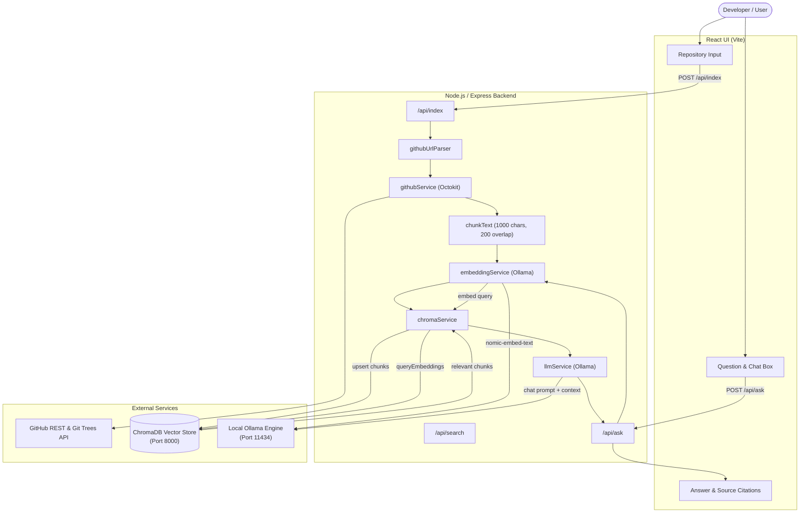

# GitHub Repository RAG Assistant

A production-style, locally-hosted Retrieval-Augmented Generation (RAG) assistant that indexes GitHub repositories and answers questions grounded strictly in the actual repository codebase.

Built with **Node.js, Express, ChromaDB, Ollama (`nomic-embed-text` & `llama3.2:1b`), and React + Vite**.

---

## 1. Project Overview

The **GitHub Repository RAG Assistant** empowers developers to query any public GitHub repository using natural language questions. Rather than sending raw code directly into large LLM context windows or hallucinating file paths, this application:
1. Extracts source code and documentation via the GitHub Tree API.
2. Filters out noise (dependencies, binaries, lock files, build artifacts).
3. Chunks code files using sliding-window chunking.
4. Generates vector embeddings locally using Ollama (`nomic-embed-text`).
5. Stores embeddings and metadata in ChromaDB with deterministic IDs.
6. Retrieves the most relevant code chunks via vector similarity search.
7. Prompts a local LLM (`llama3.2:1b`) with the retrieved context to generate accurate answers with verifiable source file citations.

---

## 2. Features

- **Direct GitHub Repository Ingestion**: Traverses repository trees via Octokit and retrieves file contents on the fly.
- **Smart File Filtering**: Automatically ignores `node_modules`, `.git`, `dist`, `build`, binary files, lockfiles, and files larger than 200KB.
- **Local Embeddings**: Generates 768-dimensional vector embeddings with local Ollama (`nomic-embed-text`)—zero external API fees.
- **Vector Storage in ChromaDB**: Stores chunk vectors with document content and path metadata using stable, deterministic IDs (`owner__repo::path::chunkIndex`).
- **Semantic Similarity Search**: Matches developer queries against relevant code chunks using cosine similarity.
- **Context Grounding & Source Citations**: Local Ollama LLM answers strictly using retrieved chunks and cites exact file paths.
- **Clean React UI**: Clean, responsive interface with indexing progress, loading indicators, Q&A chat history, and source file lists.

---

## 3. Architecture



---

## 4. Tech Stack

| Layer | Technology | Purpose |
| :--- | :--- | :--- |
| **Frontend** | React 18, Vite | Minimalist, responsive user interface |
| **Backend** | Node.js, Express 5 | RESTful API server & orchestration |
| **GitHub Integration** | `@octokit/rest` | GitHub Git Data & Tree APIs |
| **Embeddings** | Ollama (`nomic-embed-text`) | 768-dim vector embeddings |
| **Vector Database** | ChromaDB (`chromadb`) | In-memory/persistent vector search |
| **Local LLM** | Ollama (`llama3.2:1b`) | Grounded answer generation |

---

## 5. Project Structure

```text
Github-RAG/
├── backend/
│   ├── src/
│   │   ├── config/
│   │   │   ├── env.js                # Environment variable loader
│   │   │   └── chroma.js             # ChromaDB client initialization
│   │   ├── controllers/
│   │   │   ├── indexController.js    # Repository ingestion controller
│   │   │   ├── searchController.js   # Vector similarity search controller
│   │   │   └── askController.js      # Context assembly & LLM controller
│   │   ├── routes/
│   │   │   ├── indexRoutes.js        # POST /api/index
│   │   │   ├── searchRoutes.js       # POST /api/search
│   │   │   └── askRoutes.js          # POST /api/ask
│   │   ├── services/
│   │   │   ├── githubService.js      # Tree traversal & file filtering
│   │   │   ├── embeddingService.js   # Ollama nomic-embed-text client
│   │   │   ├── chromaService.js      # ChromaDB collection & upsert logic
│   │   │   └── llmService.js         # Ollama LLM grounding prompt
│   │   ├── utils/
│   │   │   ├── chunkText.js          # Sliding-window chunker
│   │   │   └── githubUrlParser.js    # GitHub URL validator & parser
│   │   ├── app.js                    # Express app configuration & middleware
│   │   └── server.js                 # Server entry point
│   ├── .env.example
│   ├── package.json
│   └── .gitignore
├── frontend/
│   ├── src/
│   │   ├── components/
│   │   │   ├── RepositoryInput.jsx   # URL input and index button
│   │   │   ├── ChatInput.jsx         # Question prompt input
│   │   │   ├── ChatMessage.jsx       # Q&A conversation card
│   │   │   ├── SourceList.jsx        # Cited files component
│   │   │   └── Loading.jsx           # Spinner & status loader
│   │   ├── pages/
│   │   │   └── Home.jsx              # Main application page
│   │   ├── services/
│   │   │   └── api.js                # Centralized frontend API client
│   │   ├── App.jsx
│   │   ├── main.jsx
│   │   └── index.css
│   ├── index.html
│   ├── vite.config.js
│   ├── package.json
│   └── .gitignore
└── README.md
```

---

## 6. How RAG Works in This Project

1. **Ingestion**:
   - The user inputs `https://github.com/owner/repository`.
   - `githubService` fetches the latest commit on the default branch and retrieves the full git tree recursively.
   - Non-code files (images, binaries, lock files, node_modules) are discarded.
   - Files are fetched in parallel and split into overlapping chunks of 1000 characters with 200 characters overlap.
2. **Embedding & Storage**:
   - Each chunk is embedded using Ollama's `nomic-embed-text`.
   - Chunks are upserted into ChromaDB with deterministic IDs: `${owner}__${repo}::${path}::${chunkIndex}`.
3. **Retrieval**:
   - When a developer asks a question (e.g., *"Where is authentication handled?"*), the query is embedded using `nomic-embed-text`.
   - ChromaDB queries the collection for the top-4 closest chunks based on cosine distance.
4. **Generation**:
   - A grounded system prompt instructs the local LLM to answer using only the retrieved code snippets.
   - The response includes the generated explanation and the exact file paths retrieved from ChromaDB metadata.

---

## 7. Installation & Setup

### Prerequisites
- [Node.js](https://nodejs.org/) (v18+)
- [Ollama](https://ollama.ai/)
- [Docker](https://www.docker.com/) (to run ChromaDB) or local ChromaDB

### Step 1: Clone and Configure Environment

```bash
cd backend
cp .env.example .env
```

Edit `backend/.env`:
```env
PORT=5000
GITHUB_TOKEN=your_github_personal_access_token_here
CHROMA_HOST=localhost
CHROMA_PORT=8000
OLLAMA_HOST=http://localhost:11434
OLLAMA_EMBED_MODEL=nomic-embed-text
OLLAMA_LLM_MODEL=llama3.2:1b
```

---

## 8. Running Ollama & Models

Make sure Ollama is running, then pull the embedding and LLM models:

```bash
# Pull the embedding model (274 MB)
ollama pull nomic-embed-text

# Pull the lightweight local LLM (1.3 GB)
ollama pull llama3.2:1b
```

---

## 9. Running ChromaDB

Run ChromaDB using Docker:

```bash
docker run -d -p 8000:8000 chromadb/chroma
```

Verify that ChromaDB is accessible:
```bash
curl http://localhost:8000/api/v1/heartbeat
```

---

## 10. Running Backend

Install backend dependencies and start the server:

```bash
cd backend
npm install
npm start
```

Backend will run on **`http://localhost:5000`**.

---

## 11. Running Frontend

Install frontend dependencies and start the Vite dev server:

```bash
cd ../frontend
npm install
npm run dev
```

Frontend will run on **`http://localhost:5173`**.

---

## 12. API Endpoints

### `GET /api/health`
Checks server status.
```json
{
  "status": "ok"
}
```

### `POST /api/index`
Indexes a GitHub repository into ChromaDB.
- **Request Body**:
  ```json
  {
    "url": "https://github.com/expressjs/express"
  }
  ```
- **Response**:
  ```json
  {
    "message": "Repository indexed successfully",
    "repository": "expressjs/express",
    "filesProcessed": 24,
    "chunksStored": 118
  }
  ```

### `POST /api/search`
Performs vector similarity search.
- **Request Body**:
  ```json
  {
    "question": "Where is routing handled?",
    "repository": "expressjs/express"
  }
  ```
- **Response**:
  ```json
  {
    "results": [
      {
        "content": "...",
        "path": "lib/router/index.js",
        "chunkIndex": 0,
        "distance": 0.28
      }
    ]
  }
  ```

### `POST /api/ask`
Answers questions with grounded LLM reasoning and source citations.
- **Request Body**:
  ```json
  {
    "question": "How does error handling middleware work?",
    "repository": "expressjs/express"
  }
  ```
- **Response**:
  ```json
  {
    "answer": "Error handling middleware is identified by accepting four arguments (err, req, res, next)...",
    "sources": [
      {
        "path": "lib/router/layer.js",
        "chunkIndex": 2,
        "repository": "expressjs/express"
      }
    ]
  }
  ```

---

## 13. Example Questions to Try

- *Where is authentication implemented?*
- *What database does this project use?*
- *What routes/endpoints are defined in this service?*
- *How are errors handled in API responses?*
- *Explain the main application initialization flow.*

---

## 14. Limitations

- **Rate Limits on Large Repositories**: Without a GitHub Personal Access Token, unauthenticated GitHub API requests are limited to 60 requests/hour. (Adding a `GITHUB_TOKEN` increases this to 5,000 requests/hour).
- **Single-Turn QA**: The current prompt answers each question independently without long-term multi-turn conversational memory.
- **Fixed-Size Chunking**: Sliding-window chunking divides text by character boundaries rather than full AST syntax boundaries.

---

## 15. Future Improvements

- **AST-Based Semantic Chunking**: Implement tree-sitter to chunk functions and classes along AST syntax boundaries.
- **Repository Branch & Tag Selector**: Allow users to select specific tags or branches rather than only the default branch.
- **Cross-Encoder Reranking**: Add a reranker (e.g., FlashRank or BGE-Reranker) to refine ChromaDB retrieval scores prior to LLM generation.
